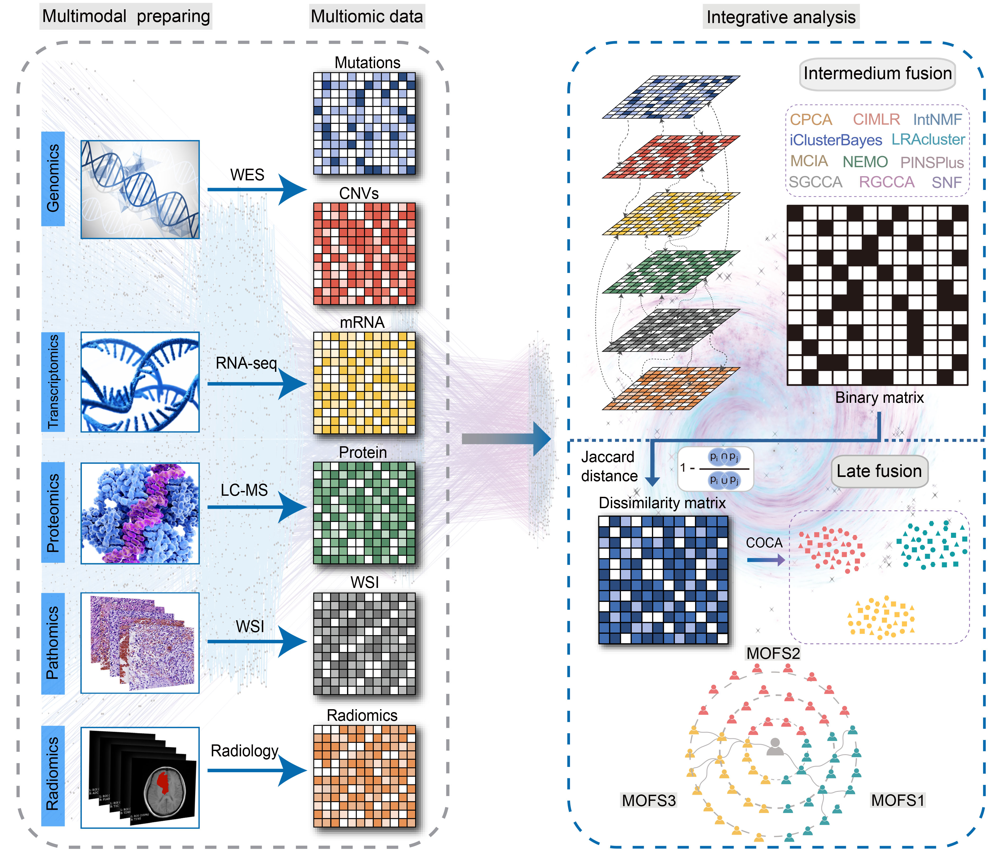

# MOFS: Multimodality Fusion Subtyping 

<!-- badges: start -->

[](https://github.com/Zaoqu-Liu/MOFS/)
[](https://github.com/Zaoqu-Liu/MOFS/MOFSR/MOFSR)
[](https://github.com/Zaoqu-Liu/MOFS/MOFSR)
[](https://hits.seeyoufarm.com)
[](https://github.com/Zaoqu-Liu/MOFS?tab=GPL-3.0-1-ov-file)
[](liuzaoqu@163.com)
[](https://github.com/Zaoqu-Liu/MOFS/)
<!-- badges: end -->

The **MOFS (Multimodality Fusion Subtyping)** framework is a comprehensive approach for integrating and analyzing multi-layer biological data to achieve clinically relevant disease subtype classification. The core principle of MOFS lies in combining diverse biological modalities—such as genomic, transcriptomic, proteomic, histopathological, and radiological data—into a unified analytical framework. By integrating these heterogeneous data sources, MOFS offers a more holistic and nuanced view of disease biology, enabling the identification of underlying patterns that might be overlooked in single-modality analyses.

Integrating multimodal data reveals causal features that may be obscured in single-modality analyses, offering a more complete understanding of diseases. Multimodal data fusion can be categorized into early, intermediate, and late fusion based on the timing of integration. **Intermediate fusion** integrates data during clustering, allowing for the identification of multimodal joint clusters, capturing dependencies between different omics layers, and revealing underlying biological mechanisms. Intermediate fusion is generally considered more advanced than both early and late fusion, but it demands more sophisticated integration algorithms.

In the MOFS framework, multiple intermediate fusion strategies are employed based on diverse principles to maximize the interpretative power and reliability of the derived subtypes. Following this, late fusion is applied to combine the results obtained from the different algorithms, culminating in a final, consensus-driven clustering outcome. It is important to note that the framework does not rely on any specific intermediate fusion algorithm. Rather, it evaluates the overall consensus from multiple clustering results, ensuring robustness and reliability.

The MOFS framework represents a powerful tool for disease subtype classification by integrating multiple biological data modalities. Through the integration of intermediate fusion and late fusion strategies, MOFS uncovers novel disease subtypes and mechanisms that may be missed in single-modality approaches. This integrated approach not only enhances the accuracy and robustness of disease classification but also provides deeper insights into disease biology, potentially guiding more personalized diagnostic and therapeutic strategies.





# MOFSR tool is designed for multimodal data fusion and analysis

### Feature Selection and Evaluation
1. **Statistical Metrics for Feature Evaluation**: The package provides several functions for calculating statistical metrics on data frames, which can be used to evaluate features. `MAD.df` calculates the median absolute deviation for each column in a data frame, `SD.df` calculates the standard deviation, `CV` calculates the coefficient of variation for a numeric vector, and `CV.df` calculates the coefficient of variation for each column in a data frame. These metrics can be used to assess the variability and distribution of features, which can be helpful in feature selection, especially when selecting hypervariable features. For example, in the `Select.Features` function, these statistical measures could potentially be used to identify features with high variance (e.g., based on standard deviation or coefficient of variation) or other characteristics relevant to the specific feature selection criteria. This allows for a more informed selection of features within a single modality or across multiple modalities, contributing to the overall goal of identifying the most relevant and informative features for further analysis, such as clustering or classification tasks within the MOFS framework.
2. **Optimal Feature Combination**: The `Find.OptClusterFeatures` plays a crucial role in this aspect. It aims to identify the most suitable combination of features for multi-modality clustering analysis. By integrating diverse modalities (such as mutation, CNV, RNA, protein, pathology, radiology), it explores the optimal number of clusters. This function utilizes Nonnegative Matrix Factorization (NMF) for cluster consistency analysis and Multi-block Principal Component Analysis (mbPCA) for assessing cluster separation. The combination of these methods not only helps in discerning distinct biological subgroups but also evaluates the stability and biological relevance of the clustering. In the process, it calculates metrics like the CPI (Cluster Performance Index) and GAP (Gap statistic) scores for all tested feature combinations and cluster numbers. The CPI and GAP scores provide quantitative measures to evaluate the quality of clustering solutions. A higher CPI or GAP score indicates a better clustering performance, and thus, the function returns a list containing the optimal feature combination along with the associated clustering score (including CPI and GAP scores) and all the results of the tested combinations, enabling users to make informed decisions about the feature selection.

### Multimodal Data Integration and Analysis
1. **Clustering Algorithm Integration**: It offers a variety of clustering algorithms, such as Consensus Iterative Multi-view Learning (CIMLR), Consensus Principal Component Analysis (CPCA), Integrative Non-negative Matrix Factorization (IntNMF), Low-Rank Approximation Clustering (LRAcluster), Multiple Co-Inertia Analysis (MCIA), Multimodality Fusion Subtyping (MOFS), NEMO, PINSPlus, Regularized Generalized Canonical Correlation Analysis (RGCCA), Sparse Generalized Canonical Correlation Analysis (SGCCA), Similarity Network Fusion (SNF), etc. These algorithms are used to integrate different modalities of data, like RNA, protein, genomic data, to identify shared patterns and structures in the data, thereby discovering potential disease subtypes or biological mechanisms.
2. **Comprehensive Evaluation of Multiple Algorithms**: The MOFS framework employs multiple intermediate fusion strategies and then uses late fusion to combine the results of different algorithms, ultimately obtaining a consensus-driven clustering result.

### Cluster Quality Evaluation
1. **Calinski-Harabasz Index with CalCHI**: The `CalCHI` function calculates the Calinski-Harabasz index for hierarchical clustering. It assesses cluster quality by comparing between-cluster and within-cluster dispersion. Higher values suggest better-defined clusters. It takes a clustering result and optional distance matrix, returning index values for different cluster numbers to help find the optimal number.
2. **PAC Calculation via CalPAC**: `CalPAC` calculates the Proportion of Ambiguous Clustering (PAC) for consensus clustering. A lower PAC indicates a more stable clustering solution. It uses consensus results and related parameters, returning PAC values for different cluster numbers.
3. **PCA Analysis by RunPCA**: `RunPCA` performs PCA on data. It helps visualize sample relationships in reduced dimensions, revealing data structure and patterns. Using the `FactoMineR` package, it provides insights and can assist in understanding clusters.
4. **Silhouette Coefficient**: The silhouette coefficient could be used to measure how well each data point lies within its cluster compared to other clusters. It provides a value between -1 and 1, where a higher value indicates better clustering. This metric can help evaluate the compactness and separation of clusters, complementing the other cluster quality evaluation methods.

### Classification Prediction Function
1. **Support for Multiple Classifiers**: It includes a variety of classifiers, such as AdaBoost, Decision Tree (DT), Elastic Net (Enet), Enrichment-based Neural Network (Enrichment), Gradient Boosted Decision Trees (GBDT), k-Nearest Neighbors (kNN), LASSO, Linear Discriminant Analysis (LDA), Naive Bayes (NBayes), Neural Network (NNet), PCA-based Neural Network (PCA), Random Forest (RF), Ridge Regression (Ridge), Stepwise Logistic Regression (StepLR), Support Vector Machine (SVM), XGBoost, etc. These classifiers can be used to predict cluster assignments for test data (single-modality data) based on trained models (single-modality data) and cluster markers.
2. **Ensemble Learning**: The `RunEnsemble` function runs an ensemble of different classification models, considering the consensus among the models, and can also perform survival analysis to filter models based on trends in clinical outcomes, providing more comprehensive and accurate prediction results.

### Functional Enrichment
1. **Gene Set Variation Analysis with RunGSVA**: The `RunGSVA` function estimates gene-set enrichment scores across samples. It offers methods like "gsva" for detecting subtle pathway activity changes, "ssgsea" for individual sample analysis, "zscore", and "plage". With parameters for expression data, gene sets, and method-specific options, it returns a gene-set by sample matrix of enrichment scores. This enables analysis of differentially enriched gene sets between groups, providing insights into perturbed biological functions and pathways.
2. **Single-Sample Pathway Activity Analysis using ssMwwGST**: The `ssMwwGST` function performs single-sample pathway activity analysis via the MWW-GST method. It calculates gene means and standard deviations, normalizes expression, assesses pathway enrichment, and corrects p-values. Taking gene expression data and gene sets as inputs, it returns matrices of NES, p-values, and FDR-adjusted p-values. These results help prioritize biologically relevant pathways, aiding in understanding underlying mechanisms and functions related to phenotypes or conditions.


## Multi-Modality Feature Selection

This R script performs multi-modality clustering by integrating diverse biological data types, such as mutation, CNV, RNA and protein expression, pathology, and radiology. Its main goal is to determine the optimal number of clusters in a multi-modality dataset using Nonnegative Matrix Factorization (NMF) and Principal Component Analysis (PCA). These approaches are effective in identifying distinct biological subgroups within complex datasets, aiding in the understanding of disease mechanisms and discovery of new therapeutic targets.

The script combines different feature subset sizes for each modality, iteratively evaluating the clustering performance. Two metrics are used to assess clustering quality: Cluster Prediction Index (CPI) and GAP statistic. CPI, calculated using the IntNMF package, measures the stability of clustering by quantifying how consistently features and samples group across multiple iterations. Higher CPI values indicate more stable and robust clustering solutions. GAP statistic, calculated using the mogsa package, helps identify the optimal number of clusters by comparing the dispersion of the actual dataset with that of a random reference dataset. The peak value of the GAP statistic indicates the most meaningful clustering structure.

Feature selection is done using Median Absolute Deviation (MAD) to rank features by variability, with higher MAD values suggesting greater potential for cluster differentiation. The script employs parallel computing with the future.apply package to accelerate the analysis, considering numerous combinations of feature subset sizes and cluster numbers.

```R
# A list of multi-modality datasets
data_list <- list(
  mutation,  # Mutation data (placeholder)
  cnv,       # Copy Number Variation data (placeholder)
  rna,       # RNA expression data
  protein,   # Protein expression data
  pathology, # Pathology data
  radiology  # Radiology imaging data
)

# Create a dataframe of all possible combinations of feature subset sizes for modality data
mrna_size <- seq(3000, 8000, 500)  # Sequence of mRNA feature subset sizes to be tested
protein_size <- seq(500, 2000, 500)  # Sequence of protein feature subset sizes to be tested
pathology_size <- seq(200, 600, 200)  # Sequence of pathology feature subset sizes to be tested
radiology_size <- seq(500, 2000, 500)  # Sequence of radiology feature subset sizes to be tested
feature_combinations <- expand.grid(mrna_size, protein_size, pathology_size, radiology_size)  # Create all possible combinations

# Calculate variance of each feature to determine their significance
# Use Median Absolute Deviation (MAD) to rank features for each data type
rna_data <- data_list$rna
mRNA_ID <- names(sort(apply(rna_data, 1, mad), decreasing = TRUE))  # Rank RNA features by MAD

protein_data <- data_list$protein
Protein_ID <- names(sort(apply(protein_data, 1, mad), decreasing = TRUE))  # Rank protein features by MAD

pathology_data <- data_list$pathology
Pathology_ID <- names(sort(apply(pathology_data, 1, mad), decreasing = TRUE))  # Rank pathology features by MAD

radiology_data <- data_list$radiology
Radiology_ID <- names(sort(apply(radiology_data, 1, mad), decreasing = TRUE))  # Rank radiology features by MAD

# Set up parallel computing
library(future.apply)
plan('multisession')  # Use multiple sessions for parallel computing

# Define the range of cluster numbers to be tested
try_num_clusters <- 2:6  # Range of clusters to try during clustering

# Loop over each row of the feature combination dataframe using parallel execution
results <- future_lapply(1:nrow(feature_combinations), function(row_n) {
  Sys.sleep(0.01)  # Short pause to simulate progress
  progress(row_n, nrow(feature_combinations))  # Show progress
  
  # Extract feature subset sizes for the current row
  subset_sizes <- as.numeric(feature_combinations[row_n, ])
  
  # Create a working copy of the data
  working_data <- data_list
  working_data$rna <- working_data$rna[mRNA_ID[1:subset_sizes[1]], ]  # Subset RNA data based on top-ranked features
  working_data$protein <- working_data$protein[Protein_ID[1:subset_sizes[2]], ]  # Subset protein data based on top-ranked features
  working_data$pathology <- working_data$pathology[Pathology_ID[1:subset_sizes[3]], ]  # Subset pathology data based on top-ranked features
  working_data$radiology <- working_data$radiology[Radiology_ID[1:subset_sizes[4]], ]  # Subset radiology data based on top-ranked features
  
  # Normalize each data type
  normalized_data <- lapply(working_data, function(dataset) {
    if (!all(dataset >= 0)) {
      dataset <- pmax(dataset + abs(min(dataset)), 0) + .Machine$double.eps  # Ensure non-negativity by shifting values
    }
    dataset <- dataset / max(dataset)  # Scale to max value of 1
    return(as.matrix(dataset))
  })
  
  # Transpose data to have features in columns (necessary for downstream analysis)
  normalized_data <- lapply(normalized_data, function(x) t(x) + .Machine$double.eps)
  
  # Perform optimal cluster number selection using NMF
  # CPI (Cluster Prediction Index) quantifies the consistency of clustering results across multiple iterations
  # CPI is calculated by evaluating the stability of clustering memberships across resampled data subsets
  opt_k_nmf <- IntNMF::nmf.opt.k(
    dat = normalized_data,        # Input data
    n.runs = 5,                   # Number of times NMF should run for each cluster number
    n.fold = 5,                   # Number of folds for cross-validation
    k.range = try_num_clusters,   # Range of clusters to try
    result = TRUE,                # Show results
    make.plot = FALSE,            # Do not plot intermediate results
    maxiter = 1000,               # Maximum number of iterations
    st.count = 10,                # Stop count threshold
    progress = FALSE              # Disable internal progress
  )
  cpi_df <- as.data.frame(opt_k_nmf)  # Convert the result to a dataframe
  cpi_df$mean <- rowMeans(cpi_df)     # Calculate mean CPI across iterations (higher CPI indicates better clustering consistency)
  
  # Perform multi-block PCA (mbPCA) for integration analysis
  # mbPCA is used to extract global components that summarize the shared variation across different modality datasets
  mbpca_result <- mogsa::mbpca(
    x = working_data,              # Input multi-modality data
    ncomp = 3,                     # Number of principal components to compute
    k = 0.5,                       # Proportion of variables to include
    method = "globalScore",       # Integration scoring method
    option = "uniform",           # Standardize across datasets
    center = TRUE,                 # Center data
    scale = TRUE,                  # Scale data
    moa = TRUE,                    # Return as moa object
    svd.solver = "fast",          # Use fast SVD solver
    maxiter = 1000,                # Maximum number of iterations
    verbose = FALSE                # Suppress output
  )
  # Perform clustering gap analysis using hierarchical clustering
  # GAP statistic measures the robustness of clustering by comparing intra-cluster dispersion to that of a reference distribution
  # The GAP statistic helps to determine the optimal number of clusters by identifying the point where the GAP value reaches its maximum
  gap_analysis <- mogsa::moGap(mbpca_result, K.max = max(try_num_clusters), cluster = "hclust", plot = FALSE)
  gap_df <- as.data.frame(gap_analysis$Tab)[-1, ]
  
  # Collect results for the current combination
  tmp <- data.frame(
    mRNA_num = subset_sizes[1],  # Number of RNA features used
    Protein_num = subset_sizes[2],  # Number of protein features used
    Pathology_num = subset_sizes[3],  # Number of pathology features used
    Radiology_num = subset_sizes[4],  # Number of radiology features used
    K = try_num_clusters,  # Number of clusters tested
    CPI = cpi_df$mean,  # Mean CPI value
    GAP = gap_df$gap  # GAP statistic value for cluster separation
  )
  return(tmp)
})

# Combine results from all iterations into one dataframe
combined_results <- Reduce(rbind, results)
# Calculate a combined score (sum of CPI and GAP)
# Higher score indicates better clustering consistency and separation
combined_results$score <- combined_results$CPI + combined_results$GAP
```

### Multi-Modality Clustering

This R script performs clustering on a multi-omics dataset using various clustering algorithms and methods, allowing for the exploration of the optimal number of clusters. The analysis employs both intermediate fusion and late-stage fusion approaches to achieve robust clustering results. The intermediate fusion strategy involves combining information across different omics types before running clustering algorithms, whereas the late-stage fusion approach clusters individual data types first and then combines their results. Each approach offers distinct advantages, such as improved interpretability and robustness in detecting cluster-specific features.

The initial steps involve using a variety of clustering algorithms on the multi-omics data. Then, an intermediate fusion approach is applied, allowing the fusion of different data types before applying clustering methods. This fusion approach allows for better integration and consistent interpretation of complex biological data. Afterward, the Jaccard distance is calculated for clustering consensus analysis, followed by consensus clustering (COCA) to derive the final clustering solution.

The script further evaluates the clustering performance using silhouette scores, PCA visualization, and clustering metrics such as the Proportion of Ambiguous Clustering (PAC) score and Calinski-Harabasz index (CHI). The final result is stored in a list, which contains all intermediate and final clustering outcomes, providing a comprehensive summary of the multi-omics clustering process.
```R
# Initialize an empty list to store the clustering results
# This part runs multiple clustering algorithms separately, storing results for each
res <- list()
res[['CPCA']] <- RunCPCA(data_list, cluster_num)  # Run CPCA clustering
res[['CIMLR']] <- RunCIMLR(data_list, cluster_num)  # Run CIMLR clustering
res[['iClusterBayes']] <- RuniClusterBayes(data_list, cluster_num)  # Run iClusterBayes clustering
res[['IntNMF']] <- RunIntNMF(data_list, cluster_num)  # Run IntNMF clustering
res[['LRAcluster']] <- RunLRAcluster(data_list, cluster_num)  # Run LRAcluster clustering
res[['MCIA']] <- RunMCIA(data_list, cluster_num)  # Run MCIA clustering
res[['NEMO']] <- RunNEMO(data_list, cluster_num)  # Run NEMO clustering
res[['PINSPlus']] <- RunPINSPlus(data_list, cluster_num)  # Run PINSPlus clustering
res[['RGCCA']] <- RunRGCCA(data_list, cluster_num)  # Run RGCCA clustering
res[['SGCCA']] <- RunSGCCA(data_list, cluster_num)  # Run SGCCA clustering
res[['SNF']] <- RunSNF(data_list, cluster_num)  # Run SNF clustering
```

#### Alternatively, you can use an intermediate fusion step by using RunIF

```R
# This allows specifying a method in the 'RunIF' function
res <- list()
res[['CPCA']] <- RunIF(data = data_list, method = 'CPCA', cluster_num)  # Run CPCA with intermediate fusion
res[['CIMLR']] <- RunIF(data = data_list, method = 'CIMLR', cluster_num)  # Run CIMLR with intermediate fusion
res[['iClusterBayes']] <- RunIF(data = data_list, method = 'iClusterBayes', cluster_num)  # Run iClusterBayes with intermediate fusion
res[['IntNMF']] <- RunIF(data = data_list, method = 'IntNMF', cluster_num)  # Run IntNMF with intermediate fusion
res[['LRAcluster']] <- RunIF(data = data_list, method = 'LRAcluster', cluster_num)  # Run LRAcluster with intermediate fusion
res[['MCIA']] <- RunIF(data = data_list, method = 'MCIA', cluster_num)  # Run MCIA with intermediate fusion
res[['NEMO']] <- RunIF(data = data_list, method = 'NEMO', cluster_num)  # Run NEMO with intermediate fusion
res[['PINSPlus']] <- RunIF(data = data_list, method = 'PINSPlus', cluster_num)  # Run PINSPlus with intermediate fusion
res[['RGCCA']] <- RunIF(data = data_list, method = 'RGCCA', cluster_num)  # Run RGCCA with intermediate fusion
res[['SGCCA']] <- RunIF(data = data_list, method = 'SGCCA', cluster_num)  # Run SGCCA with intermediate fusion
res[['SNF']] <- RunIF(data = data_list, method = 'SNF', cluster_num)  # Run SNF with intermediate fusion
```

```R
# Compute binary cluster membership matrix and Jaccard distance
bm <- get.binary.clusters(res)  # Obtain binary cluster membership matrix from results
sm <- get.Jaccard.Distance(bm)  # Calculate Jaccard distance based on the membership matrix

# Run consensus clustering (COCA) on the Jaccard distance matrix
coca_res <- RunCOCA(jaccard.matrix = sm,  # Input Jaccard distance matrix
                    max.clusters = 6,  # Maximum number of clusters to consider
                    linkage.method = "ward.D2",  # Linkage method for hierarchical clustering
                    clustering.algorithm = 'pam',  # Clustering algorithm to use
                    distance.metric = "euclidean",  # Distance metric to use for clustering
                    resampling.iterations = 10000,  # Number of iterations for resampling
                    resample.proportion = 0.7)  # Proportion of samples to resample in each iteration

# Calculate cluster metrics for evaluating clustering performance
PAC <- CalPAC(coca_res$fit)  # Calculate Proportion of Ambiguous Clustering (PAC) score
CHI <- CalCHI(hclust(as.dist(sm), method = "average"), max_clusters = 6)  # Calculate Calinski-Harabasz index for cluster evaluation

# Calculate consensus matrix and silhouette score
consMatrix <- 1 - coca_res$optimal$consensusMatrix  # Calculate consensus matrix (1 - optimal consensus matrix from COCA)
rownames(consMatrix) <- colnames(consMatrix) <- colnames(sm)  # Set row and column names for the consensus matrix
consMatrix <- as.dist(consMatrix)  # Convert consensus matrix to distance matrix format
tmp <- coca_res$Cluster$Cluster  # Extract cluster assignments from COCA results
names(tmp) <- colnames(sm)  # Set cluster assignment names to sample names
aSil <- cluster::silhouette(x = tmp, dist = consMatrix)  # Calculate silhouette scores for each sample

# Plot silhouette scores
plot(aSil, col = c('red','blue','yellow'), main = '')  # Plot silhouette scores with specific colors
abline(v = 0.5)  # Add a vertical line at silhouette score of 0.5 to indicate threshold

# Identify core samples based on silhouette scores
colnames(sm)[aSil[, 3] < 0.4]  # Identify samples with silhouette scores less than 0.4 (not well-clustered)
core_set <- colnames(sm)[aSil[, 3] >= 0.4]  # Define core set as samples with silhouette scores greater or equal to 0.4
sm_core <- sm[core_set, core_set]  # Subset Jaccard distance matrix for core samples

# Extract cluster assignment for the core set
cluster <- get.class(coca_res$fit, 3)  # Get class assignments from COCA results for 3 clusters
cluster <- cluster[match(core_set, cluster$ID), ]  # Match cluster assignment to core set

# Run PCA on the core similarity matrix
ddb.pca <- RunPCA(sm_core)  # Perform Principal Component Analysis (PCA) on core Jaccard similarity matrix

# Visualize PCA results
factoextra::fviz_pca_ind(
  X = ddb.pca,  # Input PCA result
  geom.ind = "point",  # Use point geometry for individuals
  pointshape = 21,  # Set point shape
  fill.ind = cluster$Cluster,  # Fill points based on cluster assignment
  palette = "npg",  # Use a color palette
  alpha.ind = 0.7,  # Set point transparency
  addEllipses = TRUE  # Add ellipses for each cluster
) +
  theme_classic() +
  theme(plot.title = element_text(hjust = 0.5))  # Set classic theme and center the title

# Store all the results in a list and save to a file
allres <- list(All_Cluster = resm,  # All cluster results
               JaccardDis = sm,  # Jaccard distance matrix
               coca_res = coca_res,  # Consensus clustering results
               Silhouette = aSil,  # Silhouette scores
               Core_set = core_set,  # Core set of well-clustered samples
               PCA = ddb.pca,  # PCA results
               PAC = PAC,  # PAC score
               Calinsky = aCalinsky)  # Calinski-Harabasz index
```

#### Alternatively, you can use the RunMOFS function to get all the above results directly

```R
allres <- RunMOFS(data = data_list,  # Input multi-modality dataset
                  methods = c("CPCA", "iClusterBayes", "IntNMF", "LRAcluster", "MCIA", "NEMO", "PINSPlus", "RGCCA", "SGCCA", "SNF", "CIMLR"),  # Methods to run
                  max.clusters = 6,  # Maximum number of clusters to consider
                  linkage.method = "ward.D2",  # Linkage method for clustering
                  clustering.algorithm = "pam",  # Clustering algorithm to use
                  distance.metric = "euclidean",  # Distance metric to use
                  resampling.iterations = 10000,  # Number of resampling iterations
                  resample.proportion = 0.7,  # Proportion of samples to resample
                  silhouette.cutoff = 0.4)  # Silhouette cutoff value for core sample selection
```


